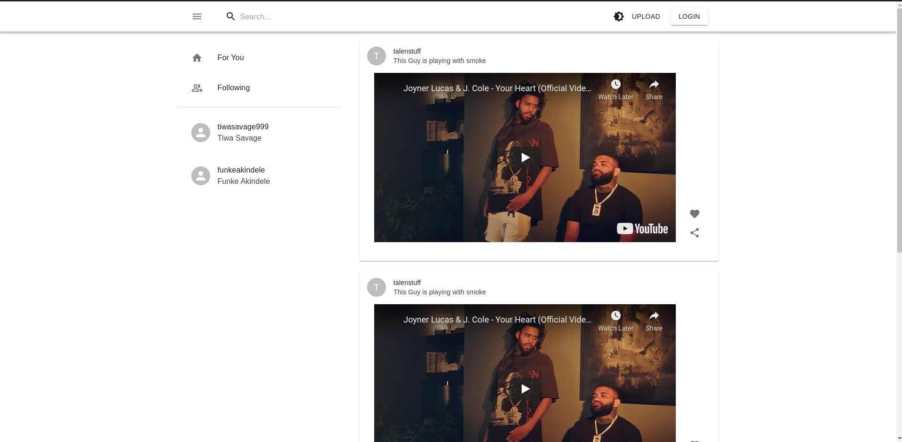

## Meme App

This is a little description about our project.

**Tech Stack:** React.js, Typescript, Django, Postgresql

---

### Getting Started

1. Clone or download repository

---

## server
1. Go into the server directory `cd server`
2. Create your enviroment variable (.env) file
3. Run `python3 manage.py runserver` to start the server

---

## client
1. Go into the client directory `cd client`
2. Run `yarn install` or `npm install` to install packages
3. Run `yarn start` or `npm start` to start the client side

---

### Demo

1. Registration. Users will be able to create a new account using their email and password

2. Home. Here is a description about what a user can expect to see

